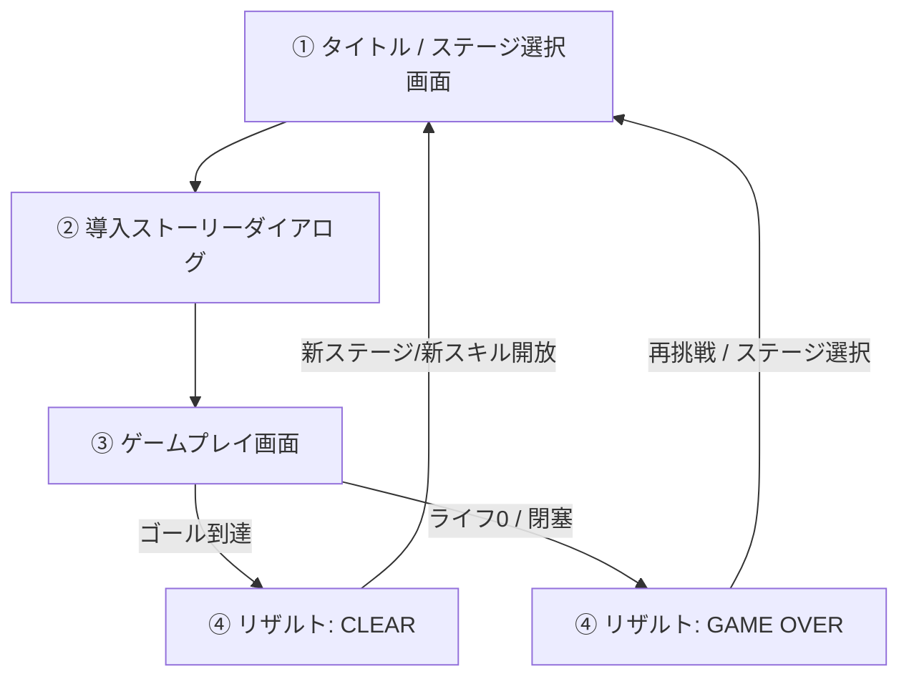

# tethiel (テティエル) - ゲーム詳細仕様書・設計ドキュメント

中央大学国際情報学部（iTL）公式キャラクター「イティエル」をモチーフにした逆テトリス型アクションパズルゲーム。

---

## 1. プロジェクト概要 & 背景コンセプト

### 1.1 背景ストーリー
サイバー攻撃の魔の手が迫る中央大学 市ヶ谷田町キャンパス。  
プレイヤーは、イティエルと共に「iTL防衛戦」に挑む。  
iTLの情報インフラとサーバーを守るため、迫り来るウイルスより先に回路を繋ぎ、サーバーコアへと到達しなければならない。  
ウイルスに追いつかれないよう迅速かつ正確にブロック（回路）を接続しながら、最上部のゴールを目指す。

### 1.2 ゲームコンセプト
- **「積んでつなげる」逆テトリス型アクションパズル**: 通常のテトリスのようにラインを消して低く保つのではなく、上から落としたミノを高く積み上げて上部ゴールを目指す。
- **緊張感とスリルの両立**: 下から徐々にせり上がってくるウイルスの侵食エリア。追いつかれる恐怖と、障害物の間をすり抜ける操作の緊迫感。
- **プレイヤー次第で変わる攻略ルート**: 最短ルートで一直線に登るか、障害物を避けて迂回するか、あるいはフィールド上のスキルアイテムを回収してボムで障害物を粉砕するか、自由な戦術性が生まれる。

---

## 2. ゲームシステム詳細仕様

### 2.1 画面構成 & フィールド
- **画面レイアウト**: 1画面固定型（スクロールなし）。低解像度モニターや展示用ノートPCでも全貌が一目で把握可能。
- **フィールドグリッド**: 横10マス × 縦20マス。
- **最上部（行0〜1）**: サーバーコア（ゴールライン）。いずれかのミノがこのラインに到達・設置されるとステージクリア。
- **最下部（行19〜）**: ウイルスの侵入元。時間経過でウイルス侵食ラインが下から上へと徐々に上昇する。

### 2.2 ブロック（ミノ）の基本ルール
- **出現（スポーン）**: 画面上部中央から、テトリス準拠の7種類のテトリミノ（I, O, T, S, Z, J, L）がランダム（7-bag方式）で落下。
- **基本操作**:
  - 左右移動: `←` / `→` (または `A` / `D`)
  - ソフトドロップ: `↓` (または `S`)
  - ハードドロップ: `Space` (または `↑` / `W`)
  - 回転: `Z` / `X` (または `↑` / `W`)
  - ホールド: `C` キー
  - スキル発動: 数字キー `1`〜`3` (またはスロットクリック)
  - ※展示環境向けに、画面上のオンスクリーンタッチ/クリックボタンも同時提供。
- **落下予測（ゴースト）**: 現在の列からまっすぐ落とした場合の着地位置を半透明で常時表示。

### 2.3 特殊ルール：ライン揃え（回路フル接続ボーナス）
- **ラインは消去されない**: 通常のテトリスと異なり、横1列（10マス）が埋まってもブロックは消えない（高さを維持）。
- **フル接続ボーナス**:
  - 横1列が揃った瞬間に「回路通電エフェクト」が走り、揃ったブロックがネオン色に発光。
  - **ウイルスの侵食が一定時間（3〜5秒）完全フリーズ**。
  - **ライフが微回復**（+15%〜20%）。
  - 同時に複数ライン（2〜4ライン）を揃えた場合はフリーズ時間と回復量が大幅に増加。

### 2.4 ウイルス侵食システム & 勝敗判定
- **ウイルス侵食ライン**: 画面最下部から一定速度（例: 4〜5秒ごとに1マス）で赤く激しく発光する侵食エリアが上昇。
- **ライフシステム**:
  - 初期ライフ: 100%。
  - 侵食エリア内にミノが浸かっている間、毎秒一定割合でライフが削られる。
  - ウイルス侵食ラインが現在操作中または最上段のミノに完全に追いつくか、ライフが0%になると**ゲームオーバー**。
- **進行不能（ロック）判定**:
  - ミノのスポーン位置（上部中央）がブロックや障害物で塞がれ、新しいミノを生成できなくなった場合もゲームオーバー。
- **クリア条件**:
  - プレイヤーの積み上げたミノが、画面最上部（ゴールライン）に設置された瞬間に**ステージクリア**。

### 2.5 障害物（セキュリティブロック） & スキルシステム
- **障害物ブロック**:
  - 各ステージ開始時からフィールド上に初期配置される固定障害物。
  - ミノはこの障害物をすり抜けられないため、狭い隙間を通すか、迂回して積み上げる必要がある。
- **フィールド配置アイテム**:
  - フィールド上の特定マス（障害物の奥や脇など）に「スキルカプセル」が浮遊。
  - 積み上げたミノがこのカプセルに接触（接続）すると回収され、画面下部のスキルスロットにストックされる（最大3個）。
- **スキル種別（プロトタイプ＆拡張）**:
  1. **ボム (Bomb)**:
     - 発動すると、現在操作中のミノの周囲（3x3マス）にある障害物や邪魔なブロックを即時消去・爆破。一気に進路を切り開く。
  2. **ウイルススロー (Virus Freeze)** [次期ステージ]:
     - 発動するとウイルスの進行を数秒間完全に停止させる。
  3. **ブースター (Circuit Extension)** [次期ステージ]:
     - 現在の最上段ミノから上方へ3マス分、回路を即座に伸長させる。
  4. **リペア (Life Heal)**:
     - 減少したライフを即時回復する。

---

## 3. 全体画面フロー & 進行サイクル

- **プロトタイプ範囲**:
  - Stage 1（入門・ファイアウォール回線）の完全動作。
  - ボムスキルの回収＆発動。
  - タイトル、ストーリー、ゲームプレイ、リザルト画面のシームレスなループ。
  - Stage 2・Stage 3 は選択画面でロック（Coming Soon）表示。

---

## 4. 技術選定 & パフォーマンス設計（展示PC対応）

- **フロントエンドフレームワーク**: Vite + React + TypeScript
  - 画面遷移（タイトル、ストーリー、リザルト、UI）はReactでスマートに保守。
  - 将来のイラスト素材（立ち絵・表情差分・イベントスチル）追加に柔軟に対応。
- **ゲームレンダリング**: HTML5 Canvas (2D Context)
  - 60fpsのアニメーションループ（`requestAnimationFrame`）。
  - Reactの再レンダリング負荷をゲームループから完全分離し、低スペックPCでも一切のカクつきなく滑らかに動作。
- **フォント**:
  - `DotGothic16` (Google Fonts: 日本語ドット調フォント)
  - `Press Start 2P` (Google Fonts: 英数字・スコア・タイマードットフォント)
- **オーディオシステム**:
  - Web Audio API（ブラウザ内蔵オシレーターによるシンセ効果音）。
  - 音声ファイル（mp3/wav等）の読み込みが一切不要なため、ネットワーク遅延ゼロ・ファイルサイズ0KB・完全軽量。
  - ワンタッチでミュート切り替え可能。
- **操作性**:
  - フルキーボード対応（矢印キー、WASD、Space、C、1〜3キー）。
  - タッチパネル・マウス展示用オンスクリーンコントローラー同時実装。
- **コード品質**:
  - Biomeによる厳格なフォーマット・Lint管理。

---

## 5. 将来の拡張計画（ロードマップ）

1. **ビジュアル・アセット強化**:
   - イティエルの公式イラスト・アニメーション立ち絵の導入。
   - ストーリーパートでの会話イベント・表情変化。
2. **ステージ追加**:
   - Stage 2: 迂回ルート主体の通信ハブ（ウイルススロー・リペアスキル追加）。
   - Stage 3: 狭路と高速ウイルスのメインサーバー防衛（ブースタースキル追加）。
3. **ランキング・展示モード**:
   - 展示会用のハイスコア・最速クリアタイムのローカル保存（LocalStorage）。
   - 一定時間無操作時のデモ自動再生（アトラクトモード）。
