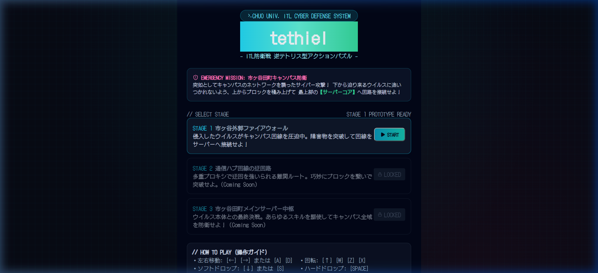
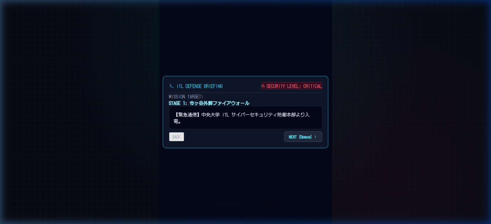

# tethiel

中央大学国際情報学部（iTL）公式キャラクター「イティエル」をモチーフにした逆テトリス型アクションパズルゲーム。  
サイバー攻撃の魔の手が迫る市ヶ谷田町キャンパスを舞台に、ウイルスに追いつかれないよう回路（ブロック）を繋ぎ、最上部のサーバーコアへ到達することを目指す。

## 目次

- [概要](#概要)
- [スクリーンショット](#スクリーンショット)
- [ゲームシステム](#ゲームシステム)
- [操作方法](#操作方法)
- [コマンド一覧](#コマンド一覧)
- [ディレクトリ構造](#ディレクトリ構造)
- [技術仕様](#技術仕様)

## 概要

- ジャンル: 逆テトリス型アクションパズル
- コンセプト: 積んでつなげるアクションパズル。ウイルスに追いつかれない緊張感とクリア時の達成感
- 対象プラットフォーム: 展示用PC・Webブラウザ（タッチパネル・低スペック端末対応）

## スクリーンショット

### タイトル・ステージ選択画面


### ミッションブリーフィング画面


## ゲームシステム

1. **上から積んでゴールを目指す**  
   上部から落下するミノを積み上げ、最上段（サーバーコア）に到達するとステージクリア。
2. **ウイルス侵食ライン**  
   画面最下部から一定速度で赤く侵食エリアが上昇。侵食エリアに浸かったブロックの数に応じてシステムHPが減少する。
3. **ライン揃え（回路フル接続ボーナス）**  
   テトリスと異なり、横一列揃ってもブロックは消去されない。代わりに回路がネオン発光し、ウイルスの侵食が一定時間停止し、システムHPが微回復する。
4. **障害物とボムスキル**  
   ステージ上に初期配置されたセキュリティ障害物ブロックを迂回するか、フィールド上のカプセルを接続して回収し、ボムスキルで周囲3x3マスを爆破して進路を切り開く。
5. **ホールド機能**  
   落ちてくるミノを1つキープ（ホールド）して戦況に応じて入れ替えることが可能。

## 操作方法

| 操作内容 | キーボード入力 | 画面タッチ / マウス |
| :--- | :--- | :--- |
| 左右移動 | `←` / `→` または `A` / `D` | `◀ LEFT` / `RIGHT ▶` ボタン |
| 回転 | `↑` / `W` / `Z` / `X` | `ROTATE` ボタン |
| ソフトドロップ | `↓` または `S` | `▼ DOWN` ボタン |
| ハードドロップ | `Space` | `⚡ DROP` ボタン |
| ホールド | `C` | `HOLD [C]` ボタン |
| スキル発動（ボム等） | `1` / `2` / `3` | スキルスロットタップ / `BOMB!` ボタン |
| 一時停止 | `P` / `Escape` | `PAUSE` ボタン |

## コマンド一覧

| コマンド | 説明 |
| :--- | :--- |
| `pnpm dev` | ローカル開発サーバーを起動する（デフォルト: http://localhost:5173/） |
| `pnpm build` | TypeScript型検査および本番用静的バンドルをビルドする |
| `pnpm preview` | ビルド成果物をローカルでプレビュー実行する |
| `pnpm format` | Biomeを用いてプロジェクト全体のコードフォーマットを実行する |
| `pnpm lint` | Biomeを用いて静的コード解析を実行する |

## ディレクトリ構造

```
tethiel/
├── docs/
│   ├── GAME_DESIGN.md         # ゲーム詳細仕様書・要件ドキュメント
│   └── screenshots/           # 画面キャプチャ画像
├── public/                    # 静的アセット
├── src/
│   ├── audio/
│   │   └── soundSystem.ts     # Web Audio APIによるシンセ効果音エンジン（外部音声ファイル0KB）
│   ├── components/
│   │   ├── GameCanvas.tsx     # 60fps HTML5 Canvasゲーム画面レンダラー
│   │   ├── GameUI.tsx         # HUD、ゲージ、スキルスロット、オンスクリーン操作ボタン
│   │   ├── ResultScreen.tsx   # クリア・ゲームオーバーリザルト画面
│   │   ├── StoryDialog.tsx    # iTL防衛戦ミッションブリーフィング会話ダイアログ
│   │   └── TitleScreen.tsx    # タイトル画面およびステージ選択
│   ├── game/
│   │   ├── constants.ts       # グリッド、ミノ定義、ステージマップ定数
│   │   ├── engine.ts          # 落下・ウイルス進行・衝突・スキル処理等のゲームエンジン
│   │   └── tetromino.ts       # 7-bag生成、SRS風壁蹴り回転、ゴースト計算
│   ├── types/
│   │   └── game.ts            # ゲームエンティティ・状態の型定義
│   ├── App.tsx                # 画面遷移・全体状態管理
│   ├── index.css              # サイバーレトロ調スタイルシート
│   └── main.tsx               # アプリケーションエントリーポイント
├── biome.json                 # Biome設定ファイル
├── index.html                 # DotGothic16 / Press Start 2P フォント設定
├── package.json               # 依存関係およびスクリプト定義
├── tsconfig.json              # TypeScriptコンパイラ設定
└── vite.config.ts             # Vite設定（ローカル開発時のタイトルprefix付与）
```

## 技術仕様

- フレームワーク: Vite + React 19 + TypeScript
- レンダリング: HTML5 Canvas 2D Context（60fps requestAnimationFrame）
- サウンド: Web Audio API（シンセサイザー合成音、外部音声ファイル不要・完全軽量）
- フォント: DotGothic16, Press Start 2P
- コード品質管理: Biome 1.9.4
