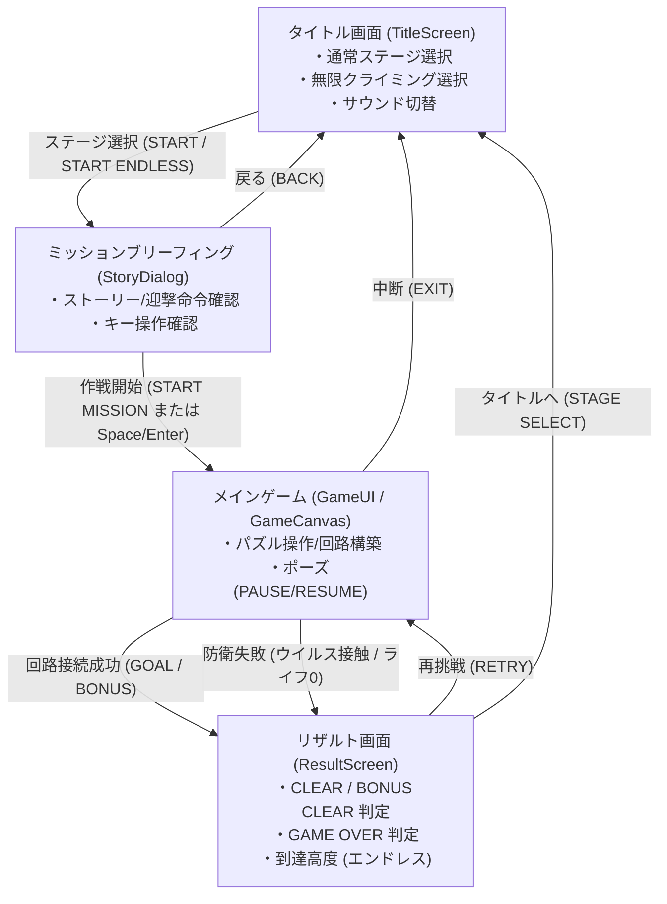

# tethiel

中央大学国際情報学部 (iTL) 公式キャラクター「イティエル」をモチーフにした逆テトリス型アクションパズルゲーム。  
企画書「逆テトリス型 回路つなぎパズル」準拠。  
サイバー攻撃の魔の手が迫る市ヶ谷田町キャンパスを舞台に、最下部「START」からブロックを積み上げて回路を繋ぎ、ウイルスに追いつかれないようイティエルを最上部の「GOAL」へと導く。

## 目次

- [概要](#概要)
- [ゲームシステム](#ゲームシステム)
- [画面遷移](#画面遷移)
- [操作方法](#操作方法)
- [コマンド一覧](#コマンド一覧)
- [ディレクトリ構造](#ディレクトリ構造)
- [技術仕様](#技術仕様)

## 概要

- ジャンル: 逆テトリス型アクションパズル
- コンセプト: 積んでつなげるアクションパズル。ウイルスに追いつかれない緊張感とクリア時の達成感
- デザイン: 学部のテーマカラー (赤) をベースとしたクリムゾンサイバー調UIと、リアルなゲーミングキートップUI
- 対象プラットフォーム: 展示用PC・Webブラウザ (タッチパネル・低スペック端末対応)

## ゲームシステム

1. **下から上へ回路を繋ぎ、イティエルが登る**  
   上から落ちてくるミノを積み上げ、最下部「START」から回路を接続。イティエルは繋がった回路を足場にして上へと登っていき、最上部ミノが白く光ります。
2. **下からせりあがるウイルス感染 (2ミノ待機・直線警戒線)**  
   ゲーム開始時、2ミノ配置完了するまでウイルスは待機します。2ミノ設置後、最下行から順に横一列 (行単位) で直線状のウイルス警戒ラインがせりあがってきます。せりあがった感染行にイティエルが呑まれるとライフを喪失します (※従来の回路辿り型感染もコード内に保持されています)。
3. **GOAL到達時の新規ミノ停止 & BONUSゴール**  
   回路の最上部が最上部「GOAL」ライン (行2以下) に到達した瞬間に、新規ミノの出現が停止し、イティエルの登頂へと移行します。右端の「BONUS」エリアへ接続すると高得点のボーナスクリアとなります。
4. **ボーナス星 (★)**  
   ステージ上の空中に浮遊する星アイテムをミノで回収すると、ボーナスカウントとスコアが加算されます (スピード重視のため控えめな配点)。
5. **トゲ障害物とミノ破壊トラップ**  
   フィールド上にトゲトゲの危険な障害物が配置されています。イティエルのいる通電回路に接続していないミノがトゲ障害物に接触して接地すると、トラップが作動してミノが粉々に破壊され、ライフが減少します。
6. **ボムスキル & ホールド**  
   `B` キーまたはボタンで周囲の障害物を爆破するボムスキル、およびミノを1つキープできるホールド (`C` キー) を搭載。
7. **スコアシステム & ルール**  
   - クリアタイムに応じた時間マイナス補正 (早くクリアするほど高得点)
   - 置いたミノ数が少ないほどプラス評価 (ミノ節約ボーナス)
   - 横一列揃っても消去や回復等のプラス効果はありません (回路接続のみに集中)
8. **エンドレスモード (無限縦スクロールクライミング)**  
   - ゴールで区切らず、イティエルが登るにつれて画面が自動で下へスクロールし続けるサバイバルモード。
   - スクロールで迫り来るウイルスラインを下に押し返すことが可能。登った最高高度 (メートル) を競います。

## 画面遷移

アプリケーションは4つの主要画面で構成され、各画面間の遷移は以下の通りです。


```mermaid
flowchart TD
    Title["タイトル画面 (TitleScreen)<br/>・通常ステージ選択<br/>・無限クライミング選択<br/>・サウンド切替"]
    Story["ミッションブリーフィング (StoryDialog)<br/>・ストーリー/迎撃命令確認<br/>・キー操作確認"]
    Game["メインゲーム (GameUI / GameCanvas)<br/>・パズル操作/回路構築<br/>・ポーズ (PAUSE/RESUME)"]
    Result["リザルト画面 (ResultScreen)<br/>・CLEAR / BONUS CLEAR 判定<br/>・GAME OVER 判定<br/>・到達高度 (エンドレス)"]

    Title -->|"ステージ選択 (START / START ENDLESS)"| Story
    Story -->|"作戦開始 (START MISSION または Space/Enter)"| Game
    Story -->|"戻る (BACK)"| Title
    Game -->|"回路接続成功 (GOAL / BONUS)"| Result
    Game -->|"防衛失敗 (ウイルス接触 / ライフ0)"| Result
    Game -->|"中断 (EXIT)"| Title
    Result -->|"再挑戦 (RETRY)"| Game
    Result -->|"タイトルへ (STAGE SELECT)"| Title
```

## 操作方法

| 操作内容 | キーボード入力 | 画面タッチ / マウス |
| :--- | :--- | :--- |
| 即置き (ハードドロップ) | `↑` または `Space` | `⚡ DROP` ボタン |
| 左回転 (反時計回り) | `Z` | `↺ ROT L` ボタン |
| 右回転 (時計回り) | `X` / `W` | `↻ ROT R` ボタン |
| 左右移動 | `←` / `→` または `A` / `D` | `◀ LEFT` / `RIGHT ▶` ボタン |
| ソフトドロップ | `↓` または `S` | `▼ DOWN` ボタン |
| ホールド | `C` | `HOLD` ボタン |
| ボム発動 | `1` / `B` | `BOMB!` ボタン |
| 一時停止 | `P` / `Escape` | `PAUSE` ボタン |

## コマンド一覧

| コマンド | 説明 |
| :--- | :--- |
| `pnpm dev` | ローカル開発サーバーを起動する (デフォルト: http://localhost:5173/) |
| `pnpm build` | TypeScript型検査および本番用静的バンドルをビルドする |
| `pnpm preview` | ビルド成果物をローカルでプレビュー実行する |
| `pnpm format` | Biomeを用いてプロジェクト全体のコードフォーマットを実行する |
| `pnpm lint` | Biomeを用いて静的コード解析を実行する |

## ディレクトリ構造

```
tethiel/
├── docs/
│   └── GAME_DESIGN.md         # ゲーム詳細仕様書・要件ドキュメント
├── public/                    # 静的アセット
├── src/
│   ├── audio/
│   │   └── soundSystem.ts     # Web Audio APIによるシンセ効果音エンジン
│   ├── components/
│   │   ├── ui/                # 共通UIコンポーネント (CyberCard, CyberButton, CyberBadge)
│   │   ├── GameCanvas.tsx     # START/GOAL、回路パス、登るイティエル、黒色感染を描画するCanvas
│   │   ├── GameUI.tsx         # 企画書5,6p準拠の3カラムHUD (ハート5つ、ステータス、立ち絵枠、操作説明)
│   │   ├── Keycap.tsx         # 2重立体構造のリアルなキートップコンポーネント
│   │   ├── ResultScreen.tsx   # 通常/ボーナスクリア・リザルト画面
│   │   ├── StoryDialog.tsx    # iTL防衛戦ミッションブリーフィングダイアログ
│   │   └── TitleScreen.tsx    # タイトル画面およびステージ選択
│   ├── game/
│   │   ├── constants.ts       # グリッド(12x22)、障害物・星配置、START/GOAL定数
│   │   ├── engine.ts          # BFS回路探索・登頂・感染・勝敗判定ゲームエンジン
│   │   └── tetromino.ts       # 7-bag生成、壁蹴り回転、ゴースト計算
│   ├── types/
│   │   └── game.ts            # ゲームエンティティ・状態の型定義
│   ├── App.tsx                # 画面遷移・全体状態管理
│   ├── index.css              # サイバーレトロ調スタイルシート
│   └── main.tsx               # アプリケーションエントリーポイント
├── biome.json                 # Biome設定ファイル
├── index.html                 # DotGothic16 / Press Start 2P フォント設定
├── package.json               # 依存関係およびスクリプト定義
├── tsconfig.json              # TypeScriptコンパイラ設定
└── vite.config.ts             # Vite設定 (ローカル開発時のタイトルprefix付与)
```

## 技術仕様

- フレームワーク: Vite + React 19 + TypeScript
- レンダリング: HTML5 Canvas 2D Context (60fps requestAnimationFrame)
- サウンド: Web Audio API (シンセサイザー合成音、外部音声ファイル不要・完全軽量)
- フォント: DotGothic16, Press Start 2P
- コード品質管理: Biome 1.9.4
